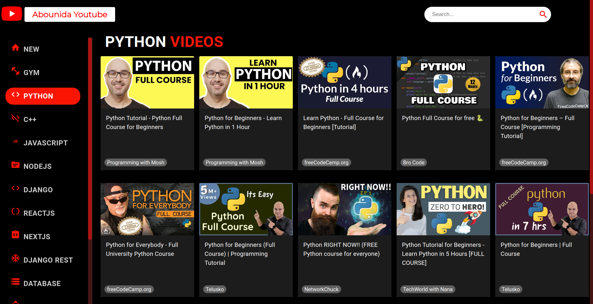

# Youtube Clone
https://abounidayoutube.netlify.app/

 

  
  

A Youtube Clone Web page using Youtube API

### Installation ###
   1. Clone this project.
      - `$ git clone git@github.com:AbdelrahmanAbounida/youtubeclone.git`
   2. Go to the workspace:
      - `$ cd youtubeclone`
   3.install npm modules:
      - `$ npm install
   4. Run server.
      - npm start

